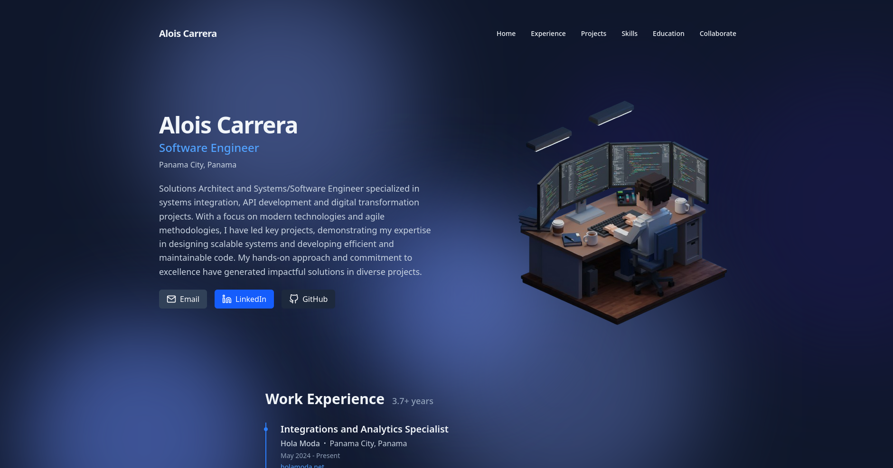

# Alois Carrera - Portfolio

A modern, responsive personal portfolio website built with Astro and Tailwind CSS.



## 🚀 Features

- **Fast Performance** - Built with Astro's static site generation for optimal loading speed
- **Responsive Design** - Looks great on all devices from mobile to desktop
- **Dark Mode Support** - Automatic theme detection with manual toggle option
- **Interactive UI** - Smooth scrolling, animations, and intuitive navigation
- **SEO Optimized** - Meta tags and structured data for better search engine visibility
- **Dynamic Content** - Content management via Directus headless CMS
- **Accessibility** - WCAG compliant for all users

## 🧰 Tech Stack

- [Astro](https://astro.build/) - Static site builder
- [Tailwind CSS](https://tailwindcss.com/) - Utility-first CSS framework
- [TypeScript](https://www.typescriptlang.org/) - Type-safe JavaScript
- [Feather Icons](https://feathericons.com/) - Simple, elegant SVG icons
- [Directus](https://directus.io/) - Headless CMS for content management

## 🛠️ Development

### Prerequisites

- Node.js 18.14.1 or higher
- npm 9.3.1 or higher

### Getting Started

1. Clone the repository
   ```bash
   git clone https://github.com/AloisCRR/portfolio.git
   cd portfolio
   ```

2. Install dependencies
   ```bash
   npm install
   ```

3. Start the development server
   ```bash
   npm run dev
   ```

4. Open your browser and visit `http://localhost:4321`

### Available Commands

| Command              | Action                                           |
| :------------------- | :----------------------------------------------- |
| `npm install`        | Install dependencies                             |
| `npm run dev`        | Start dev server at `localhost:4321`             |
| `npm run build`      | Build your production site to `./dist/`          |
| `npm run preview`    | Preview your build locally before deploying      |

## 📄 Project Structure

```
/
├── public/            # Static assets
├── src/
│   ├── assets/        # Images and other assets
│   ├── components/    # Reusable UI components
│   ├── layouts/       # Page layouts
│   ├── lib/           # Utility functions and API clients
│   ├── pages/         # Route pages
│   └── styles/        # Global styles
└── package.json
```

## 🙏 Acknowledgements

- [Astro](https://astro.build/)
- [Tailwind CSS](https://tailwindcss.com/)
- [Feather Icons](https://feathericons.com/)
- [Directus](https://directus.io/)